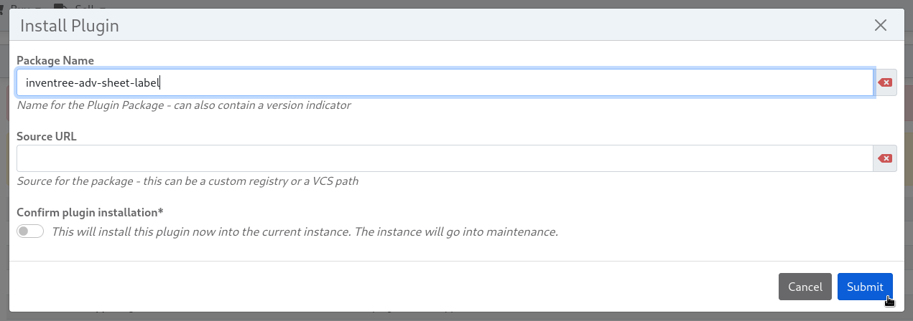
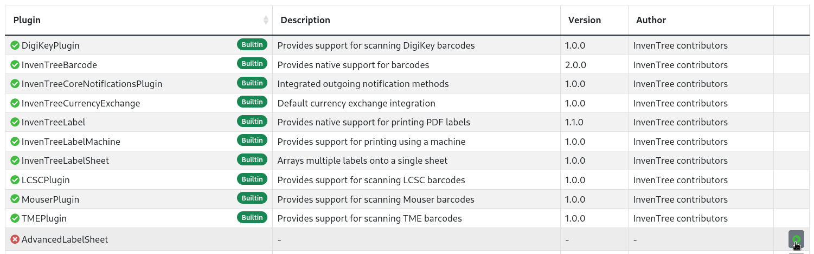
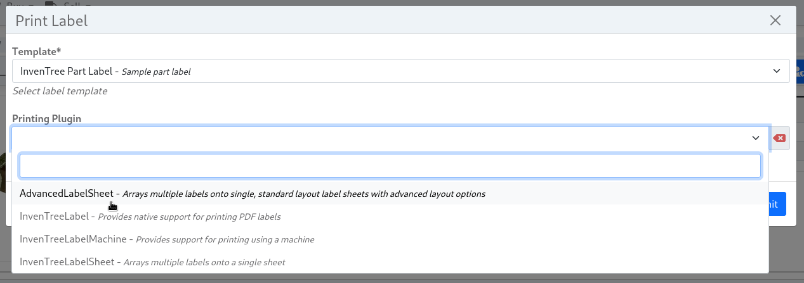
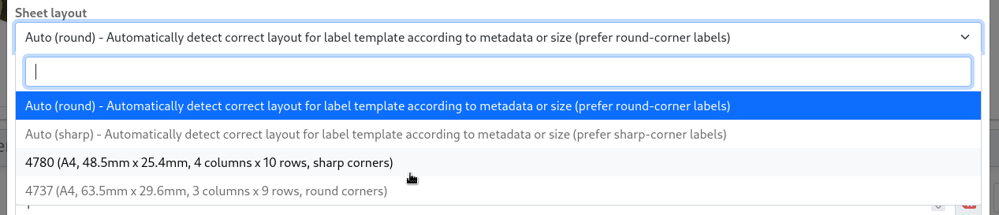

# InvenTree Advanced Sheet Label Printing Plugin

A label printing plugin for [InvenTree](https://inventree.org) which provides support for printing labels on off-the-shelf label sheet layouts and adds some more useful compared to the sheet label plugin included with InvenTree.

## Installation

The simplest way of installing is by using the ```Install Plugin``` button on the InvenTree ```Plugin Settings``` page and then entering the package name:



Alternatively, you can install this plugin manually in the InvenTree container as follows:

```
pip install inventree-adv-sheet-label
```

Or, add the package name to your plugins.txt file (this is automatically done when using the UI method) to install automatically using the ```invoke install``` command:

```
inventree-adv-sheet-label
```

In any case, after installation, the plugin needs to be enabled in the above mentioned plugin settings page:



## Usage and Features

This plugin adds the "AdvancedLabelSheet" printing option to the label printing dialog:



### Sheet layout

Unlike the builtin sheet label printing plugin of inventree, this plugin presents a selection of preconfigured sheet label layout options corresponding to various kinds off-the-shelf label printing paper that can be purchased from most office supply shops and easily printed on any standard 2D printer.

You can select the layout corresponding your paper in the ```Sheet layout``` dropdown:


These layouts are identified by a four digit number written on the paper packaging, which (as far as I can tell) is unique to the layout independent of the manufacturer (at least where I live). The identifier is however just a string, so any other scheme can also be used in the future.

The dropdown list also shows some additional information about the layout for orientation:

- Paper size (e.g. A4)
- Dimensions of the individual labels
- How many rows and columns are on one page
- Whether the labels have rounded corners

Currently supported layouts:

| Layout Identifier | Paper size | Label dimensions | Label layout | Corner style |
| ----------------- | ---------- | ---------------- | -------------| ------------ |
| 4780 | A4 | 48.5mm x 25.4mm | 4 columns x 10 rows | sharp | 
| 4737 | A4 | 63.5mm x 29.6mm | 3 columns x 9 rows | round | 

As of right now, this selection is limited to whatever layouts I personally own and use. If the paper layout you need is not included, please file an [Issue with the "Sheet Layout" template](https://github.com/melektron/inventree-adv-sheet-label/issues/new?assignees=melektron&labels=sheet+layout&projects=&template=sheet-layout.md&title=New+Sheet+layout%3A+%5Blayout+name%5D) so it can be added for everyone. The template tells you everything you need to know.

You can also select one of the two ```Auto``` sheet layout presets. These will automatically select the correct sheet layout for the label template you are printing. This is done in one of three ways:
- If you have a specific layout that's always used for a specific template, you can add the ```{"sheet_layout": "..."}``` metadata key to your label template configuration (replace ... with the identifier of the layout. This might not be the same as the display name, see [here](https://github.com/melektron/inventree-adv-sheet-label/blob/main/advanced_sheet_label/layouts.py#L77) what the identifier is). This is cleanest way to automatically configure the correct layout for your templates.
- If the selected template template has no such metadata, the plugin will attempt to find a layout with the exactly the required label size and use that one. If multiple matches are found, the first on is selected while prefering ones with round or sharp corners depending on your selection.
- If no exact matches are found, the closest layout that can fit your label template will be selected and shown to the user in an error message. The user can then decide to use this option by selecting the ['Ignore label size mismatch'](#ignore-label-size-mismatch) switch. 


### Number of labels

### Skip label positions

### Ignore label size mismatch

### Print border

### Label fill color


## Development setup

To develop the plugin, setup an InvenTree development instance using devcontainers according to this [this](https://docs.inventree.org/en/latest/develop/devcontainer/) official documentation. It is also recommended to setup the example dataset for experimenting.

Then clone this repo separately on your host computer and link it to the devserver according to [the documentation](https://docs.inventree.org/en/latest/develop/devcontainer/#plugin-development) way.

It is also recommended to save the workspace as a file (maybe somewhere in inventree repo but don't commit it) and include the intellisenseconfig as well as editor layout there.

The InvenTree intellisense path might be something like  ```/home/inventree/src/backend/InvenTree``` instead of the path from the documentation.

After that, start the InvenTree server with the debugger and the plugin should now be usable and debuggable.
